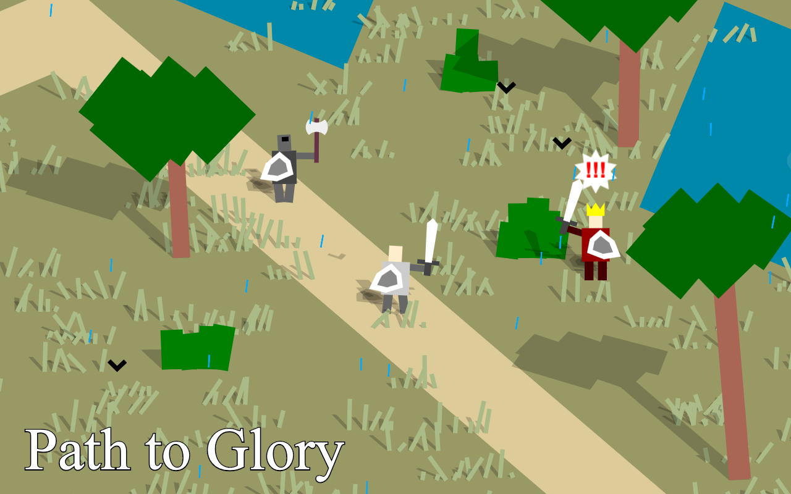

> 1254 AD
> The Kingdom of Syldavia is being invaded by the Northern Empire.
> The Syldavian army is outnumbered and outmatched.
> One lone soldier decides to take on the emperor himself.

Path To Glory

Path to Glory is my entry for 2023's <a>JS13K</a>.The theme for the competition was 13th century.
The game is a historically inaccurate beat'em up where you fight waves of enemies until you reach the final boss.
You can play the game at <a>http://glory.tap2play.io/</a>

Build

> make install
> make

Debugging

when opening debug.html:
* F to speeed up time
* G to slow down time
* level = new TestLevel() to use test level
* level = new GameplayLevel() to skip tutorial
* level = new Gameplaylevel(99) to jump straight to the final boss

License

Feel free to read the code but don't use it for commercial purposes.The game is the result of a lot of hard work and I wish to maintain all rights to it

Please reach out if you wish to distribute the game onyour portal
